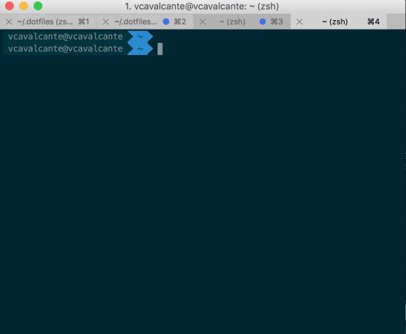

**Work-In-Progress (Beta)** 

# Evandro Reis (RedPill.digital) .dotfiles e config scripts para macOS 

Antes de mais nada, aqui ficam meus agradecimentos ao [Victor Cavalcante](https://github.com/vcavalcante/) (grande amigo da Lambda3) que indicou-me seu tutorial de .dotfiles. Estou baseando muito das configurações que seguem aqui no trabalho inicial dele. Valeu, brother. 

**AVISO:** Se você quiser usar esses dotfiles e scripts de configuração, primeiro faça um fork com o comando abaixo: 

```bash
git clone https://github.com/evandropaes/dotfiles.git ~/.dotfiles
```
Depois revise o código e remova tudo aquilo que você ache desnecessário. Não tente usar cegamente as configurações se você não sabe o que está fazendo. Use por sua conta e risco!

Eu mantenho este repositório como *meu* dotfiles, mas você pode usar como se fosse seu. :)
Fique a vontade em mandar sugestões, correções e esculachos, mas só vou aceitar os não ofensivos e os pull requests se realmente tiver valor. 

# Setup
#### Instalação e uso

* Forque este repositório por sua conta e risco (que medo)
* Clone o repositório
* *Leia* o manual abaixo de como faço o meu Setup
* Be happy :)
* Don't blame me se algo der errado. 

## O que são os Dotfiles?

Dotfiles nada mais são do que arquivos que começam com ".", por isso o nome, a maioria dos software no macOS e no Linux guardam suas configurações em arquivos e por convenção começam com "." (esses arquivos são ocultos).

A ideia é que você possa guardar esses arquivos e restaurar na sua nova máquina e vai ter de volta as configurações que você já estava acostumado, mas os Dotfiles sozinhos não fazem mágica, por isso escrevi esse manual. Além deles vamos usar scripts shell para automatizar algumas coisas, brew para instalar software, e outras coisinhas a mais.

## Passo-a-passo for newbies

### 1. Atualize seu macOS X

Garanta que tudo esteja atualizado.

1. Vá até a App Store e clique em Updates. Deixe o macOS fazer seu trabalho, clicando em Update All.

### 2. Instale o [Xcode](https://developer.apple.com/xcode/) e o ["Command Line Tools"](https://developer.apple.com/downloads/index.action)

1. Vá até a App Store e install Xcode.
2. Abra e aceite os termos
3. Então vá ate o terminal e instale "Command Line Tools":

```sh
  xcode-select --install
```

### 3. Instale os Dotfiles

Vá até o [meu repositório Dotfiles](https://github.com/evandropaes/dotfiles) e fork para o seu github. Isso é muito importante, pois você irá fazer modificações nesses arquivos e a ideia é que você guarde no seu github para quando precisar recuperar.

Clone o repositório para o direto ~/.dotfiles

```sh
git clone https://github.com/evandropaes/dotfiles.git ~/.dotfiles
```

Agora temos todos os arquivos necessários no Mac mas ainda não está no lugar correto. Agora precisamos criar um link simbolico (symlink) desses arquivos que estão no .dotfiles para a raiz do seu usuário (~/). Assim podemos manter esses arquivos separados em um diretório que está dentro do repositório git.

Mas antes vamos instalar algumas coisas:

### 4. Instalando os Softwares

Tento instalar tudo via Homebrew ou Brew Cask, enquanto o [Homebrew project](http://brew.sh/) é um projeto que foi desenvolvido para gerenciar pacotes para o macOS, o Brew Cask é uma extensão desse mesmo projeto que permite instalação de aplicações gráficas (*.app), como Browsers, IDEs e tudo mais.

Primeiro verifique se o brew já está instalado se não estiver, instale:

```sh
/usr/bin/ruby -e "$(curl -fsSL https://raw.githubusercontent.com/Homebrew/install/master/install)"
```
Se por acaso você encontrar um erro de permissão nas instalações, execute: 

```sh
chown -R ($whoami) /usr/local
```

Há 2 scripts dentro do repositório para realizar as instalações dos softwares, são eles:

* scripts/brew.sh
* scripts/brew-cask.sh

Execute cada um deles separadamente

```sh
./scripts/brew.sh
./scripts/brew-cask.sh
```

#### O que está incluso?

##### HomeBrew

* [CoreUtils](https://pt.wikipedia.org/wiki/GNU_Core_Utilities)
* [MoreUtils](https://joeyh.name/code/moreutils/)
* [FindUtils](https://www.gnu.org/software/findutils/)
* [Gnu-sed](https://www.gnu.org/software/sed/)
* [Bash](https://www.gnu.org/software/bash/)
* [grc](http://korpus.juls.savba.sk/~garabik/software/grc.html)
* [wget](https://www.gnu.org/software/wget/)
* [vim](http://www.vim.org/)
* [grep](https://www.gnu.org/software/grep/)
* [screen](https://www.gnu.org/software/screen)
* [Entr](http://entrproject.org/)
* [gh](https://github.com/jingweno/gh)
* [mtr](https://www.bitwizard.nl/mtr/)
* [sift](https://sift-tool.org/)
* [git](https://git-scm.com/)
* [imagemagick](https://www.imagemagick.org/script/index.php)
* [node](https://nodejs.org/)
* [pv](https://www.ivarch.com/programs/pv.shtml)
* [rename](http://plasmasturm.org/code/rename/)
* [tree](http://mama.indstate.edu/users/ice/tree/)
* [zopfli](https://github.com/google/zopfli)
* [ffmpeg](https://ffmpeg.org/)
* [wifi-password](https://github.com/rauchg/wifi-password)
* [terminal-notifier](https://github.com/julienXX/terminal-notifier)
* [httpie](https://httpie.org/)
* [Android-platform-tool](https://developer.android.com/sdk)
* [pidcat](https://github.com/JakeWharton/pidcat)
* [zsh](http://www.zsh.org/)
* [fish](https://fishshell.com)
* [nvm](https://github.com/creationix/nvm)
* [dotnet](https://www.microsoft.com/net/core#macos)
* [z](https://github.com/rupa/z)

##### Brew Cask

###### Uso diário

* [spectacle](https://spectacleapp.com/)
* [dropbox](http://dropbox.com)
* [gyazo](https://gyazo.com/)


###### Browser

* [Firefox Aurora](http://www.mozilla.org/en-US/firefox/aurora/)
* [Chrome](https://www.google.com/intl/en/chrome/browser/)
* [Chrome Canary](https://www.google.com/intl/en/chrome/browser/canary.html)
* [Opera Next](http://www.opera.com/computer/next)

###### Development

* [Sublime Text](http://www.sublimetext.com/) 
* [iTerm 2](http://www.iterm2.com/#/section/home) 
* [Source Tree](http://www.sourcetreeapp.com/) 
* [imagealpha](https://pngmini.com/)
* [imageoptim](https://imageoptim.com/)
* [visual-studio-code](https://code.visualstudio.com/)
* [Parallels desktop](https://parallels.com)

###### Browsers 

* [google-chrome-canary](https://www.google.com/chrome/browser/canary.html?platform=mac)
* [firefoxnightly](https://nightly.mozilla.org)
* [webkit-nightly](https://webkit.org/downloads/)
* [chromium](https://www.chromium.org/Home)
* [torbrowser](https://www.torproject.org/projects/torbrowser.html)

###### Outros

* [disk-inventory-x](http://www.derlien.com)
* [vlc](https://www.videolan.org/vlc/)
* [gpgtools](https://gpgtools.org)
* [licecap](http://www.cockos.com/licecap/)
* [utorrent](http://www.utorrent.com/intl/en/)
* [alfred](https://www.alfredapp.com)
* [Skype](http://www.skype.com/en/)
* [Spotify](https://www.spotify.com)
* [uTorrent](http://www.utorrent.com/)
* [lastpass](https://lastpass.com)
* [caffeine](http://lightheadsw.com/caffeine/)
* [dash](https://kapeli.com/dash)
* [Evernote](http://evernote.com/) 


### 5. Instale outros goodies

[Trash-cli](https://www.npmjs.com/package/trash-cli) (já me ferrei dando rm em arquivo errado)

```sh
npm install --global trash-cli
```

[z](github.com/rupa/z) isso é mágico, ahhh como eu <3 o z

```sh
git clone https://github.com/rupa/z.git ~/code/z
chmod +x ~/code/z/z.sh
```

### 6. Configure o git

#### Gere SSH keys para GitHub
Visite o [Guia oficial do GitHub](https://help.github.com/articles/generating-ssh-keys#platform-mac) para instruções.

#### Configure o usuário de commit

```sh
git config --global user.name "(Seu Nome)"
git config --global user.email (seu e-mail)
```

### 7 Configurações do macOS

Eu me inspirei no dotfiles do Victor Cavalcante, que por sua vez se inspirou no PaulIrish, que se inspirou no mathias. A ideia é ter um script que set todas as configurações que você gosta do Mac. Tem de tudo nesse arquivo. Eu ajustei para as minhas necessidades e você deve olhar e arrumar para as suas.

```sh
sh ~/.dotfiles/scripts/configmacos.sh
```

### 8. Configure o shell padrão para o ZSH e instale o OH-My-ZSH

Quanto estava usando Windows sempre quis usar um terminal elegante, bonito e prático. Testei alguns, comecei com o bash, depois fui para o fish e finalmente caí no zsh, foi o que mais gostei, ainda mais quando descobri o Oh My ZSH, que é um conjunto de configurações e plugins/temas, que facilitam muito o uso.

Primeiro defina o zsh como shell padrão

```sh
chsh -s /bin/zsh
```

Depois instale o Oh-My-ZSH
```sh
sh -c "$(curl -fsSL https://raw.githubusercontent.com/robbyrussell/oh-my-zsh/master/tools/install.sh)"
```

Instale as fonts do powerline

```sh
cp ~/.dotfiles/fonts/. /Library/Fonts/
```

Para ficar bonito precisa ajustar o tema do iTerm para usar o tema solarized dark e a fonte do powerline

1. iTerm2 -> Preferences
2. Profiles 
3. Colors
4. Color Presets... -> Selecione Solarized Dark
5. Ainda em Profiles selecione Text
6. Mude a font para Mezlo LG M DZ for powerline

Para finalizar a configuração do terminal é necessário linkar os dotfiles que estão do diretório `~/.dotfiles` para o diretório `~/`, para isso execute o commando abaixo:

```sh
cd ~/.dotfiles
~/.dotfiles/scripts/symlink-setup.sh
```

Após realizar essa configuração deverá fechar o iTerm2 e abrir novamente. Seu terminal deve estar como a imagem abaixo:



### 9. Configure o [Chrome Canary](https://www.google.com/intl/en/chrome/browser/canary.html) como browser Default.

1. Abra System Preferences
2. General ➜ Default Web Browser
3. Selecione “Chrome Canary” from the drop-down menu


### 10. Configurar os workflows do [Alfred](http://alfredapp.com) 

Visite [minha coleção de workflows do Alfred](https://github.com/vcavalcante/alfred-workflows) para ver se gosta, se gostar, é só clonar e abrir cada arquivo no alfred, isso já instalará cada um dos wokflows.

### 11. Configure o usuário do [NPM](http://npmjs.org)

```sh
npm adduser evandropaes
```

### 12. Trabalhe feliz!

:)


